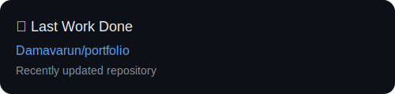

<!-- ================== HEADER ================== -->

  

<h1 align="center">Hi 👋, I'm Varun</h1>

  

  🚀 Focused on <b>DSA + Competitive Programming + Full Stack Development</b>

  
  
  

  

---

<!-- ================== ABOUT ME ================== -->

  

- 🎓 Computer Science student with strong **DSA fundamentals**
- 🧠 Active **Competitive Programmer**
- 💻 Skilled in **Web Development**
- ⛓️ Building **Blockchain & Web3 applications**
- 🎯 Goal: Top tech & Web3 internships

---

<!-- ================== TECH STACK ================== -->

  

  

---

<!-- ================== WEBSITE ================== -->

  

  

---

<!-- ================== CODING PROFILES ================== -->

  

  
  
  

  
  
  

---

<!-- ================== CP STATS ================== -->

  

  
  

---

<!-- ================== ACHIEVEMENTS ================== -->

  

- 🏅 Participated in **ICPC Regional Contest**
- 🥇 Runner in a **Hackathon at hookup IIIT Kota**
- 🎯 Active competitive programmer across platforms

---

<!-- ================== LAST WORK DONE ================== -->

  

<!-- CURRENT_PROJECT_START -->

  

<!-- CURRENT_PROJECT_END -->

---

<!-- ================== CONTRIBUTIONS ================== -->

  

  

---

  ⭐ If you like my work, consider starring my repositories!

